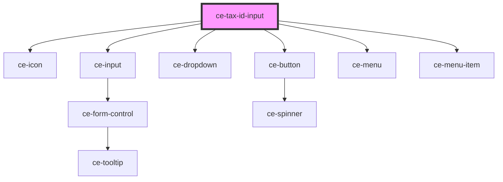

# ce-tax-id-input

<!-- Auto Generated Below -->

## Properties

| Property     | Attribute    | Description           | Type                                                                                                                                          | Default                    |
| ------------ | ------------ | --------------------- | --------------------------------------------------------------------------------------------------------------------------------------------- | -------------------------- |
| `draft`      | --           |                       | `{ shipping_country: string; }`                                                                                                               | `{ shipping_country: '' }` |
| `order`      | --           |                       | `Order`                                                                                                                                       | `undefined`                |
| `show`       | `show`       | Force show the field. | `boolean`                                                                                                                                     | `false`                    |
| `tax_status` | `tax_status` |                       | `"address_invalid" \| "calculated" \| "disabled" \| "estimated" \| "reverse_charged" \| "tax_registration_not_found" \| "tax_zone_not_found"` | `undefined`                |

## Dependencies

### Depends on

- [ce-icon](../../ui/icon)
- [ce-input](../../ui/input)
- [ce-dropdown](../../ui/dropdown)
- [ce-button](../../ui/button)
- [ce-menu](../../ui/menu)
- [ce-menu-item](../../ui/menu-item)

### Graph

----------------------------------------------

*Built with [StencilJS](https://stenciljs.com/)*
