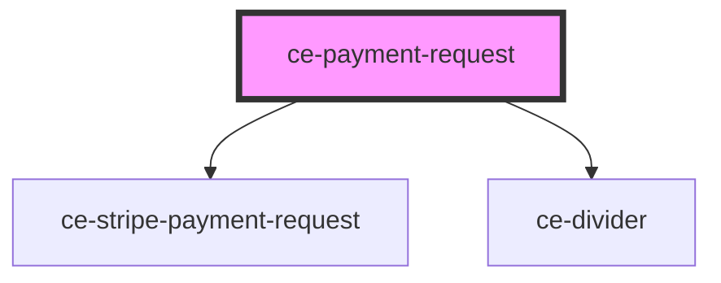

# ce-payment-request

<!-- Auto Generated Below -->

## Properties

| Property               | Attribute                | Description | Type                   | Default     |
| ---------------------- | ------------------------ | ----------- | ---------------------- | ----------- |
| `paymentMethod`        | `payment-method`         |             | `"paypal" \| "stripe"` | `undefined` |
| `stripePublishableKey` | `stripe-publishable-key` |             | `string`               | `undefined` |
| `total`                | `total`                  |             | `number`               | `undefined` |

## Dependencies

### Depends on

- [ce-stripe-payment-request](../../ui/stripe-payment-request)
- [ce-divider](../../ui/divider)

### Graph

----------------------------------------------

*Built with [StencilJS](https://stenciljs.com/)*
