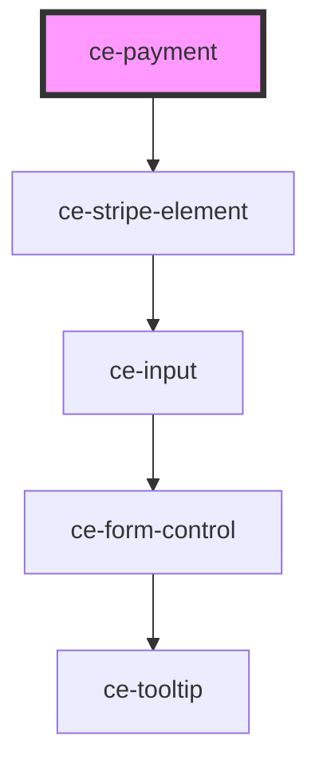

# ce-payment

<!-- Auto Generated Below -->

## Properties

| Property               | Attribute                | Description                                | Type               | Default     |
| ---------------------- | ------------------------ | ------------------------------------------ | ------------------ | ----------- |
| `checkoutSession`      | --                       | Checkout Session from ce-checkout.         | `CheckoutSession`  | `undefined` |
| `mode`                 | `mode`                   | Is this created in "test" mode             | `"live" \| "test"` | `'live'`    |
| `paymentMethod`        | `payment-method`         | The current payment method for the payment | `string`           | `'stripe'`  |
| `stripeAccountId`      | `stripe-account-id`      | Your stripe connected account id.          | `string`           | `undefined` |
| `stripePublishableKey` | `stripe-publishable-key` | Your stripe publishable key.               | `string`           | `undefined` |

## Dependencies

### Depends on

- [ce-stripe-element](../../ui/stripe-element)

### Graph

----------------------------------------------

*Built with [StencilJS](https://stenciljs.com/)*
