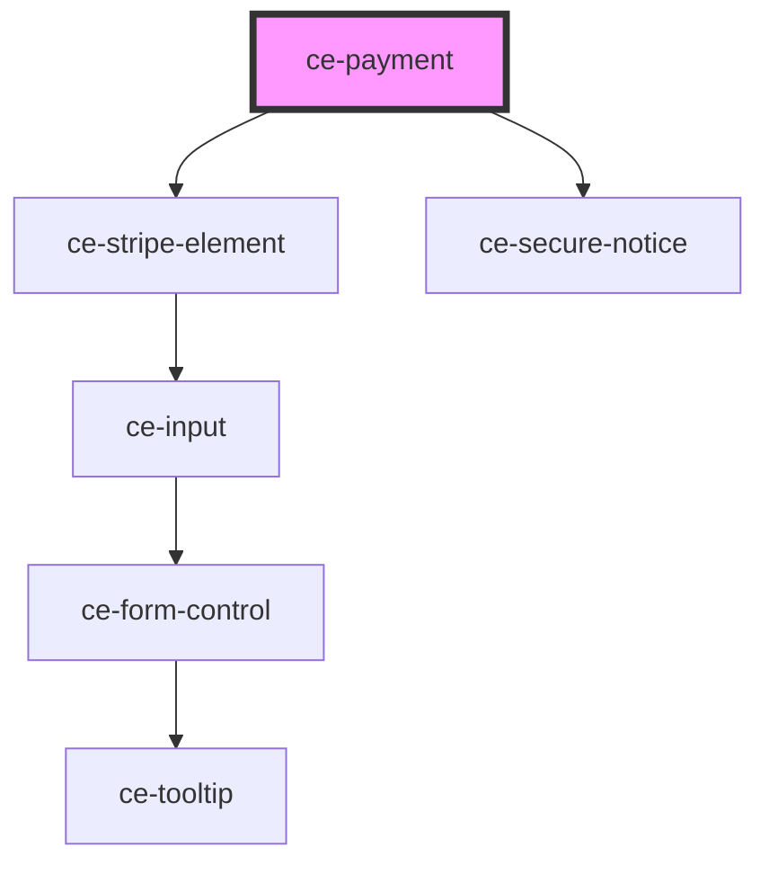

# ce-payment

<!-- Auto Generated Below -->

## Properties

| Property          | Attribute           | Description                                | Type               | Default                                                          |
| ----------------- | ------------------- | ------------------------------------------ | ------------------ | ---------------------------------------------------------------- |
| `checkoutSession` | --                  | Checkout Session from ce-checkout.         | `CheckoutSession`  | `undefined`                                                      |
| `keys`            | --                  | Your stripe publishable key.               | `Keys`             | `{     stripe: '',     stripeAccountId: '',     paypal: '',   }` |
| `label`           | `label`             | The input's label.                         | `string`           | `undefined`                                                      |
| `mode`            | `mode`              | Is this created in "test" mode             | `"live" \| "test"` | `'live'`                                                         |
| `paymentMethod`   | `payment-method`    | The current payment method for the payment | `string`           | `'stripe'`                                                       |
| `secureNotice`    | `secure-notice`     | Secure notice                              | `string`           | `undefined`                                                      |
| `stripeAccountId` | `stripe-account-id` | Your stripe connected account id.          | `string`           | `undefined`                                                      |

## Dependencies

### Depends on

- [ce-stripe-element](../../ui/stripe-element)
- [ce-secure-notice](../../ui/secure-notice)

### Graph

----------------------------------------------

*Built with [StencilJS](https://stenciljs.com/)*
