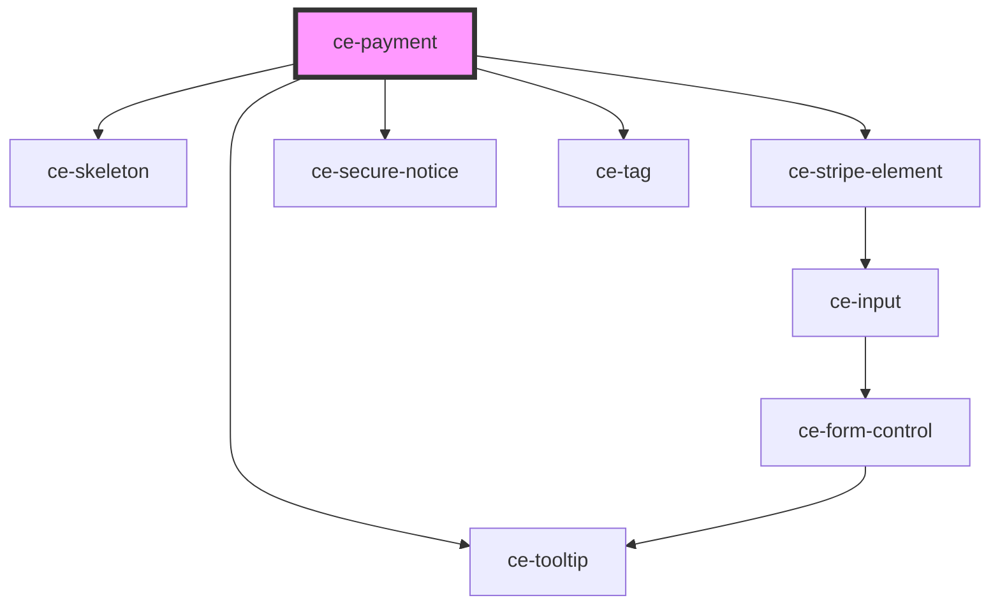

# ce-payment

<!-- Auto Generated Below -->

## Properties

| Property        | Attribute        | Description                                                          | Type                       | Default     |
| --------------- | ---------------- | -------------------------------------------------------------------- | -------------------------- | ----------- |
| `label`         | `label`          | The input's label.                                                   | `string`                   | `undefined` |
| `loading`       | `loading`        | Is this loading.                                                     | `boolean`                  | `undefined` |
| `mode`          | `mode`           | Is this created in "test" mode                                       | `"live" \| "test"`         | `'live'`    |
| `order`         | --               | Checkout Session from ce-checkout.                                   | `Order`                    | `undefined` |
| `paymentMethod` | `payment-method` | Payment mode inside individual payment method (i.e. Payment Buttons) | `"stripe-payment-request"` | `undefined` |
| `processor`     | `processor`      | The current payment method for the payment                           | `string`                   | `'stripe'`  |
| `secureNotice`  | `secure-notice`  | Secure notice                                                        | `string`                   | `undefined` |

## Dependencies

### Depends on

- [ce-skeleton](../../ui/skeleton)
- [ce-stripe-element](../../ui/stripe-element)
- [ce-secure-notice](../../ui/secure-notice)
- [ce-tooltip](../../ui/tooltip)
- [ce-tag](../../ui/tag)

### Graph

----------------------------------------------

*Built with [StencilJS](https://stenciljs.com/)*
