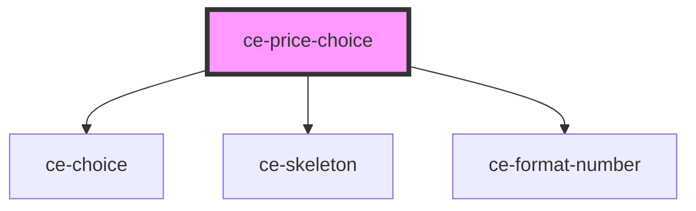

# ce-price-choice

<!-- Auto Generated Below -->

## Properties

| Property          | Attribute  | Description                | Type                                                                                                                                                                                                                                                                                                                                                                                       | Default     |
| ----------------- | ---------- | -------------------------- | ------------------------------------------------------------------------------------------------------------------------------------------------------------------------------------------------------------------------------------------------------------------------------------------------------------------------------------------------------------------------------------------ | ----------- |
| `checked`         | `checked`  | Is this checked by default | `boolean`                                                                                                                                                                                                                                                                                                                                                                                  | `false`     |
| `checkoutSession` | --         | Session                    | `CheckoutSession`                                                                                                                                                                                                                                                                                                                                                                          | `undefined` |
| `label`           | `label`    | Label for the choice.      | `string`                                                                                                                                                                                                                                                                                                                                                                                   | `undefined` |
| `priceId`         | `price-id` | Id of the price.           | `string`                                                                                                                                                                                                                                                                                                                                                                                   | `undefined` |
| `prices`          | --         | Price entities             | `{ [id: string]: { id: string; name: string; description?: string; amount: number; currency: string; recurring: boolean; recurring_interval?: "day" \| "week" \| "month" \| "year"; recurring_interval_count?: number; archived: boolean; product_id?: string; archived_at?: string; created_at: number; updated_at: number; product?: string; metadata: { [key: string]: string; }; }; }` | `{}`        |
| `products`        | --         | Product entity             | `{ [id: string]: Product; }`                                                                                                                                                                                                                                                                                                                                                               | `{}`        |
| `quantity`        | `quantity` | Default quantity           | `number`                                                                                                                                                                                                                                                                                                                                                                                   | `1`         |
| `type`            | `type`     | Choice Type                | `"checkbox" \| "radio"`                                                                                                                                                                                                                                                                                                                                                                    | `undefined` |

## Events

| Event              | Description            | Type                        |
| ------------------ | ---------------------- | --------------------------- |
| `ceAddEntities`    | Add entities           | `CustomEvent<any>`          |
| `ceAddLineItem`    | Toggle line item event | `CustomEvent<LineItemData>` |
| `ceRemoveLineItem` | Toggle line item event | `CustomEvent<LineItemData>` |

## Dependencies

### Depends on

- [ce-choice](../../ui/choice)
- [ce-skeleton](../../ui/skeleton)
- [ce-format-number](../../util/format-number)

### Graph

----------------------------------------------

*Built with [StencilJS](https://stenciljs.com/)*
