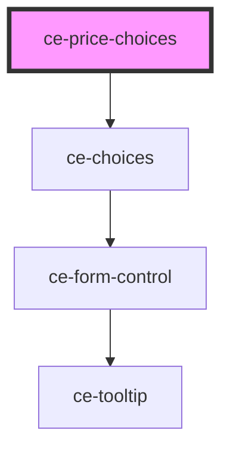

# ce-price-choices

<!-- Auto Generated Below -->

## Properties

| Property   | Attribute  | Description         | Type      | Default     |
| ---------- | ---------- | ------------------- | --------- | ----------- |
| `columns`  | `columns`  | Number of columns   | `number`  | `1`         |
| `label`    | `label`    | Selector label      | `string`  | `undefined` |
| `required` | `required` | Required by default | `boolean` | `false`     |

## Events

| Event              | Description            | Type                        |
| ------------------ | ---------------------- | --------------------------- |
| `ceRemoveLineItem` | Toggle line item event | `CustomEvent<LineItemData>` |
| `ceUpdateLineItem` | Toggle line item event | `CustomEvent<LineItemData>` |

## Dependencies

### Depends on

- [ce-choices](../../ui/choices)

### Graph

----------------------------------------------

*Built with [StencilJS](https://stenciljs.com/)*
