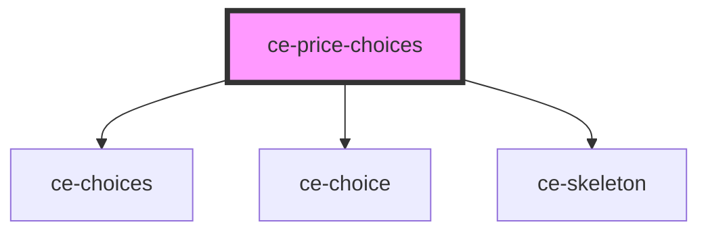

# ce-price-choices

<!-- Auto Generated Below -->

## Properties

| Property       | Attribute | Description | Type                    | Default                             |
| -------------- | --------- | ----------- | ----------------------- | ----------------------------------- |
| `columns`      | `columns` |             | `number`                | `1`                                 |
| `default`      | `default` |             | `string`                | `undefined`                         |
| `lineItemData` | --        |             | `LineItemData[]`        | `undefined`                         |
| `loading`      | --        |             | `Loading`               | `{ prices: false, session: false }` |
| `priceIds`     | --        |             | `string[]`              | `undefined`                         |
| `prices`       | --        |             | `Price[]`               | `undefined`                         |
| `type`         | `type`    |             | `"checkbox" \| "radio"` | `'radio'`                           |

## Events

| Event               | Description | Type                          |
| ------------------- | ----------- | ----------------------------- |
| `ceUpdateLineItems` |             | `CustomEvent<LineItemData[]>` |

## Dependencies

### Depends on

- [ce-choices](../../ui/choices)
- [ce-choice](../../ui/choice)
- [ce-skeleton](../../ui/skeleton)

### Graph

----------------------------------------------

*Built with [StencilJS](https://stenciljs.com/)*
