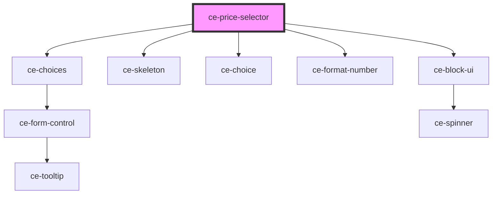

# ce-price-selector

<!-- Auto Generated Below -->

## Properties

| Property          | Attribute | Description                   | Type                                                                                                                                                                                                                                                                                                                                                                                                                                                              | Default                   |
| ----------------- | --------- | ----------------------------- | ----------------------------------------------------------------------------------------------------------------------------------------------------------------------------------------------------------------------------------------------------------------------------------------------------------------------------------------------------------------------------------------------------------------------------------------------------------------- | ------------------------- |
| `busy`            | `busy`    | Busy                          | `boolean`                                                                                                                                                                                                                                                                                                                                                                                                                                                         | `false`                   |
| `checkoutSession` | --        | The current checkout session. | `CheckoutSession`                                                                                                                                                                                                                                                                                                                                                                                                                                                 | `undefined`               |
| `choices`         | --        | Choices to choose from        | `PriceChoice[]`                                                                                                                                                                                                                                                                                                                                                                                                                                                   | `undefined`               |
| `columns`         | `columns` | Number of columns             | `number`                                                                                                                                                                                                                                                                                                                                                                                                                                                          | `1`                       |
| `defaultChoice`   | --        | The default choice.           | `{ id: string; quantity: number; }`                                                                                                                                                                                                                                                                                                                                                                                                                               | `{ id: '', quantity: 1 }` |
| `label`           | `label`   | Selector label                | `string`                                                                                                                                                                                                                                                                                                                                                                                                                                                          | `undefined`               |
| `prices`          | --        | Price entities                | `{ [id: string]: { id: string; name: string; description?: string; amount: number; currency: string; recurring: boolean; recurring_interval?: "day" \| "week" \| "month" \| "year"; recurring_interval_count?: number; ad_hoc: boolean; ad_hoc_max_amount: number; ad_hoc_min_amount: number; archived: boolean; product_id?: string; archived_at?: string; created_at: number; updated_at: number; product?: string; metadata: { [key: string]: string; }; }; }` | `undefined`               |
| `products`        | --        | Product entity                | `{ [id: string]: Product; }`                                                                                                                                                                                                                                                                                                                                                                                                                                      | `undefined`               |
| `type`            | `type`    | Choice Type                   | `"checkbox" \| "radio"`                                                                                                                                                                                                                                                                                                                                                                                                                                           | `undefined`               |

## Events

| Event              | Description            | Type                        |
| ------------------ | ---------------------- | --------------------------- |
| `ceAddEntities`    | Add entities           | `CustomEvent<any>`          |
| `ceRemoveLineItem` | Toggle line item event | `CustomEvent<LineItemData>` |
| `ceToggleLineItem` | Toggle line item event | `CustomEvent<LineItemData>` |
| `ceUpdateLineItem` | Toggle line item event | `CustomEvent<LineItemData>` |

## Dependencies

### Depends on

- [ce-choices](../../ui/choices)
- [ce-skeleton](../../ui/skeleton)
- [ce-choice](../../ui/choice)
- [ce-format-number](../../util/format-number)
- [ce-block-ui](../../ui/block-ui)

### Graph

----------------------------------------------

*Built with [StencilJS](https://stenciljs.com/)*
