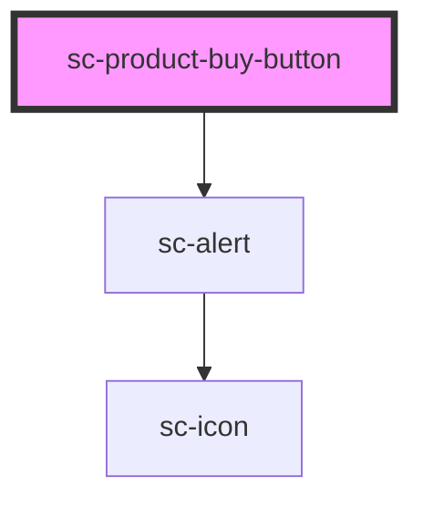

# sc-product-buy-button

<!-- Auto Generated Below -->

## Properties

| Property       | Attribute       | Description | Type               | Default     |
| -------------- | --------------- | ----------- | ------------------ | ----------- |
| `addToCart`    | `add-to-cart`   |             | `boolean`          | `undefined` |
| `checkoutLink` | `checkout-link` |             | `string`           | `undefined` |
| `formId`       | `form-id`       |             | `number`           | `undefined` |
| `mode`         | `mode`          |             | `"live" \| "test"` | `'live'`    |
| `product`      | --              |             | `Product`          | `undefined` |

## Dependencies

### Depends on

- [sc-alert](../../../ui/alert)

### Graph

----------------------------------------------

*Built with [StencilJS](https://stenciljs.com/)*
