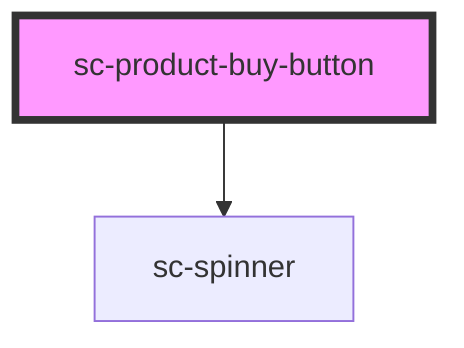

# sc-product-buy-button

<!-- Auto Generated Below -->

## Properties

| Property         | Attribute           | Description        | Type      | Default                          |
| ---------------- | ------------------- | ------------------ | --------- | -------------------------------- |
| `addToCart`      | `add-to-cart`       |                    | `boolean` | `undefined`                      |
| `classes`        | `classes`           | Classes            | `string`  | `''`                             |
| `outOfStockText` | `out-of-stock-text` | Out of stock text. | `string`  | `__('Out of Stock', 'surecart')` |
| `styles`         | `styles`            | Styles             | `string`  | `''`                             |
| `text`           | `text`              | Text               | `string`  | `__('Add to Cart', 'surecart')`  |

## Dependencies

### Depends on

- [sc-spinner](../../../ui/spinner)

### Graph

----------------------------------------------

*Built with [StencilJS](https://stenciljs.com/)*
