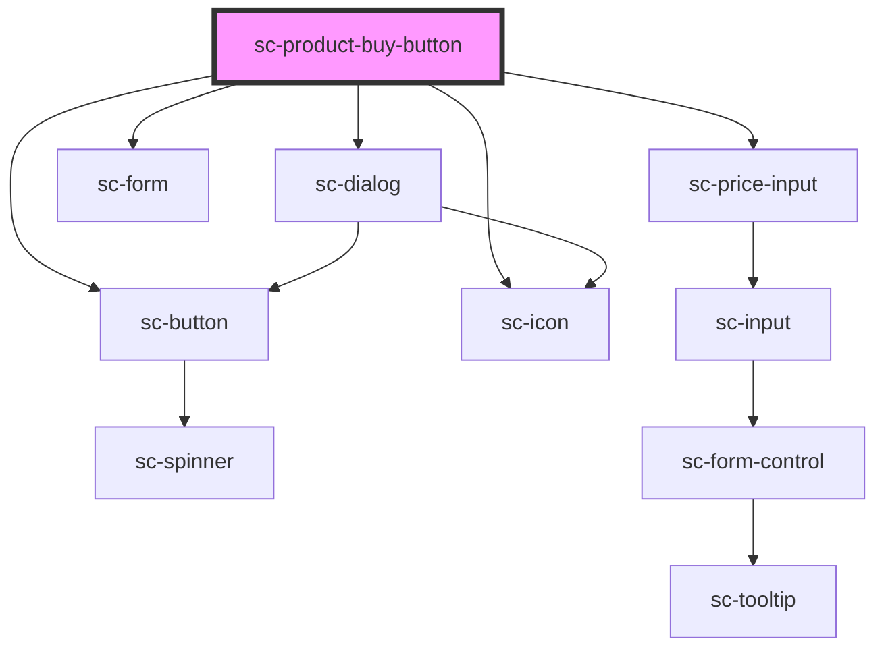

# sc-product-buy-button

<!-- Auto Generated Below -->

## Properties

| Property    | Attribute     | Description                    | Type                                                                                         | Default     |
| ----------- | ------------- | ------------------------------ | -------------------------------------------------------------------------------------------- | ----------- |
| `addToCart` | `add-to-cart` | Is this an add to cart button? | `boolean`                                                                                    | `undefined` |
| `busy`      | `busy`        | Is the order busy              | `boolean`                                                                                    | `undefined` |
| `full`      | `full`        | Full                           | `boolean`                                                                                    | `false`     |
| `icon`      | `icon`        | Icon to show.                  | `string`                                                                                     | `undefined` |
| `outline`   | `outline`     | Outline                        | `boolean`                                                                                    | `false`     |
| `showTotal` | `show-total`  | Show the total.                | `boolean`                                                                                    | `undefined` |
| `size`      | `size`        | The button's size.             | `"large" \| "medium" \| "small"`                                                             | `'medium'`  |
| `type`      | `type`        | The button type.               | `"danger" \| "default" \| "info" \| "link" \| "primary" \| "success" \| "text" \| "warning"` | `'default'` |

## Dependencies

### Depends on

- [sc-button](../../../ui/button)
- [sc-icon](../../../ui/icon)
- [sc-dialog](../../../ui/sc-dialog)
- [sc-form](../../../ui/form)
- [sc-price-input](../../../ui/price-input)

### Graph

----------------------------------------------

*Built with [StencilJS](https://stenciljs.com/)*
