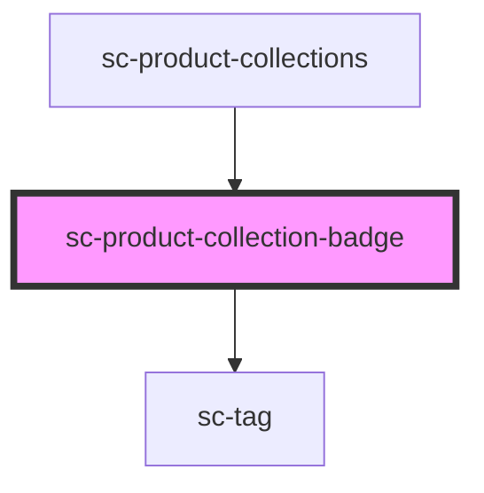

# sc-product-collection-badge

<!-- Auto Generated Below -->

## Properties

| Property | Attribute | Description                                | Type                                                                     | Default     |
| -------- | --------- | ------------------------------------------ | ------------------------------------------------------------------------ | ----------- |
| `name`   | `name`    | Collection name                            | `string`                                                                 | `undefined` |
| `pill`   | `pill`    | Draws a pill-style tag with rounded edges. | `boolean`                                                                | `false`     |
| `size`   | `size`    | Collection tag size                        | `"large" \| "medium" \| "small"`                                         | `'medium'`  |
| `type`   | `type`    | Collection tag type                        | `"danger" \| "default" \| "info" \| "primary" \| "success" \| "warning"` | `undefined` |

## Dependencies

### Used by

 - [sc-product-collections](../sc-product-collections)

### Depends on

- [sc-tag](../../../ui/tag)

### Graph

----------------------------------------------

*Built with [StencilJS](https://stenciljs.com/)*
