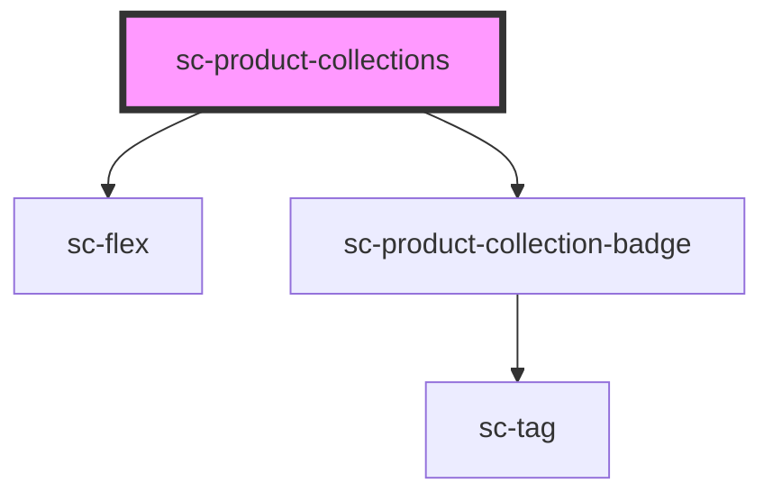

# sc-product-collections

<!-- Auto Generated Below -->

## Properties

| Property          | Attribute          | Description                                | Type                                                                     | Default     |
| ----------------- | ------------------ | ------------------------------------------ | ------------------------------------------------------------------------ | ----------- |
| `collectionCount` | `collection-count` | Number of collection tags to show          | `number`                                                                 | `undefined` |
| `pill`            | `pill`             | Draws a pill-style tag with rounded edges. | `boolean`                                                                | `false`     |
| `size`            | `size`             | Collection tag size                        | `"large" \| "medium" \| "small"`                                         | `'medium'`  |
| `type`            | `type`             | Collection tag type                        | `"danger" \| "default" \| "info" \| "primary" \| "success" \| "warning"` | `undefined` |

## Dependencies

### Depends on

- [sc-flex](../../../ui/flex)
- [sc-product-collection-badge](../sc-product-collection-badge)

### Graph

----------------------------------------------

*Built with [StencilJS](https://stenciljs.com/)*
