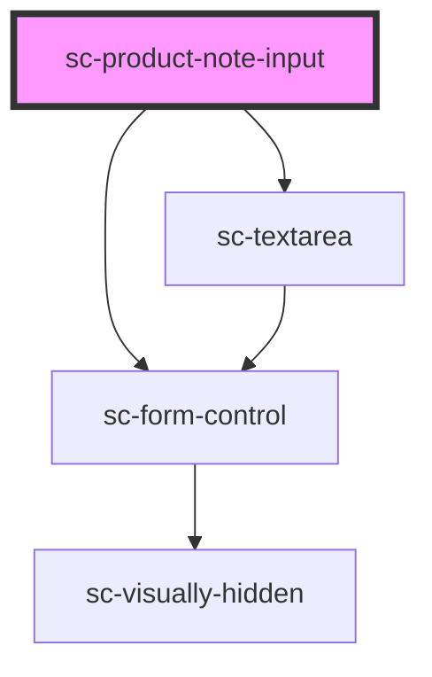

# sc-product-note-input

<!-- Auto Generated Below -->

## Properties

| Property      | Attribute     | Description                                     | Type                             | Default                                   |
| ------------- | ------------- | ----------------------------------------------- | -------------------------------- | ----------------------------------------- |
| `errors`      | `errors`      | Display server-side validation errors.          | `any`                            | `undefined`                               |
| `help`        | `help`        | Help text                                       | `string`                         | `undefined`                               |
| `label`       | `label`       | Input label.                                    | `string`                         | `__('Note', 'surecart')`                  |
| `maxlength`   | `maxlength`   | Maximum characters allowed                      | `number`                         | `500`                                     |
| `name`        | `name`        | Name for the input. Used for validation errors. | `string`                         | `undefined`                               |
| `placeholder` | `placeholder` | Placeholder text                                | `string`                         | `__('Add a note (optional)', 'surecart')` |
| `productId`   | `product-id`  | The product id                                  | `string`                         | `undefined`                               |
| `required`    | `required`    | Whether the input is required.                  | `boolean`                        | `false`                                   |
| `showLabel`   | `show-label`  | Show the label.                                 | `boolean`                        | `true`                                    |
| `size`        | `size`        | Size of the control                             | `"large" \| "medium" \| "small"` | `'medium'`                                |

## Dependencies

### Depends on

- [sc-form-control](../../../ui/form-control)
- [sc-textarea](../../../ui/sc-textarea)

### Graph

----------------------------------------------

*Built with [StencilJS](https://stenciljs.com/)*
