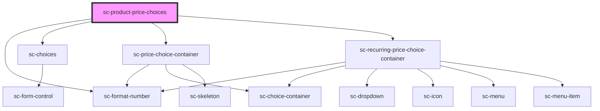

# sc-product-price-choices

<!-- Auto Generated Below -->

## Properties

| Property    | Attribute    | Description | Type      | Default     |
| ----------- | ------------ | ----------- | --------- | ----------- |
| `label`     | `label`      |             | `string`  | `undefined` |
| `showPrice` | `show-price` |             | `boolean` | `undefined` |

## Dependencies

### Depends on

- [sc-format-number](../../../util/format-number)
- [sc-choices](../../../ui/choices)
- [sc-price-choice-container](../../../ui/sc-price-choice-container)
- [sc-recurring-price-choice-container](../../../ui/sc-recurring-price-choice-container)

### Graph

----------------------------------------------

*Built with [StencilJS](https://stenciljs.com/)*
