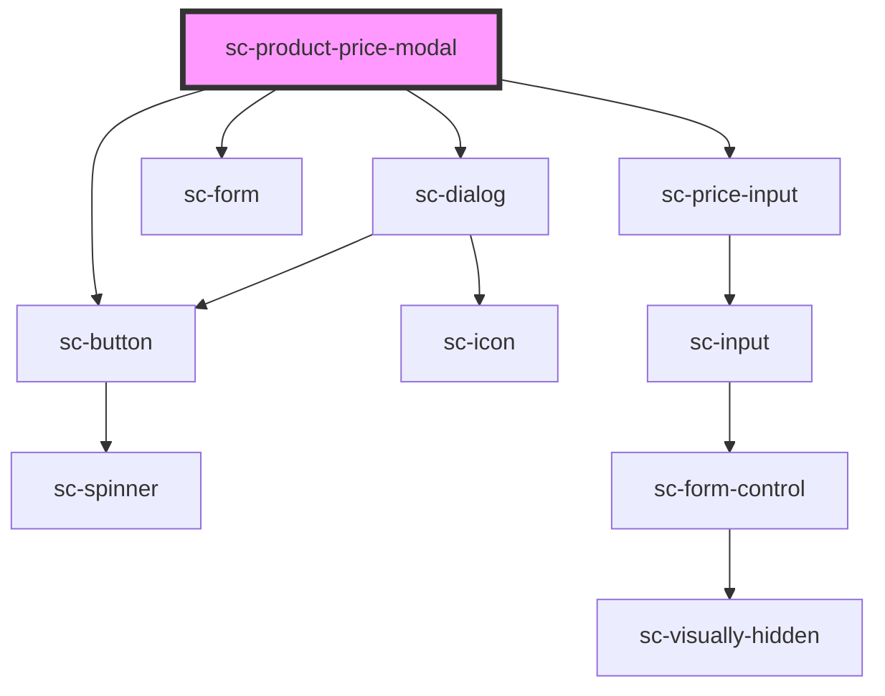

# sc-product-price-modal

<!-- Auto Generated Below -->

## Properties

| Property     | Attribute     | Description            | Type      | Default     |
| ------------ | ------------- | ---------------------- | --------- | ----------- |
| `addToCart`  | `add-to-cart` | Whether to add to cart | `boolean` | `undefined` |
| `buttonText` | `button-text` | The button text        | `string`  | `undefined` |
| `productId`  | `product-id`  | The product id         | `string`  | `undefined` |

## Dependencies

### Depends on

- [sc-dialog](../../../ui/sc-dialog)
- [sc-form](../../../ui/form)
- [sc-price-input](../../../ui/price-input)
- [sc-button](../../../ui/button)

### Graph

----------------------------------------------

*Built with [StencilJS](https://stenciljs.com/)*
