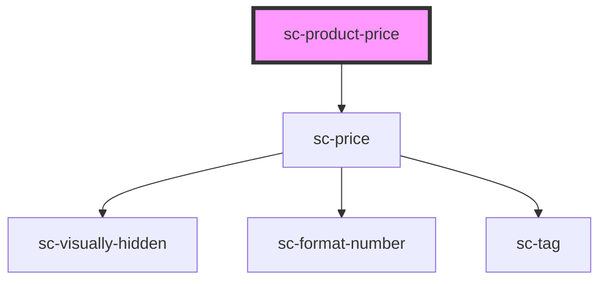

# sc-product-prices

<!-- Auto Generated Below -->

## Properties

| Property    | Attribute    | Description           | Type      | Default     |
| ----------- | ------------ | --------------------- | --------- | ----------- |
| `prices`    | --           | The product's prices. | `Price[]` | `undefined` |
| `productId` | `product-id` | The product id        | `string`  | `undefined` |
| `saleText`  | `sale-text`  | The sale text         | `string`  | `undefined` |

## Dependencies

### Depends on

- [sc-price](../../../ui/price)

### Graph

----------------------------------------------

*Built with [StencilJS](https://stenciljs.com/)*
