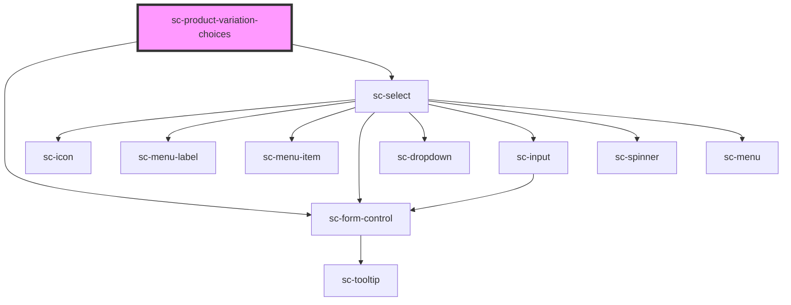

# sc-product-variation-choices

<!-- Auto Generated Below -->

## Properties

| Property  | Attribute  | Description | Type      | Default     |
| --------- | ---------- | ----------- | --------- | ----------- |
| `isDummy` | `is-dummy` |             | `boolean` | `undefined` |

## Shadow Parts

| Part            | Description |
| --------------- | ----------- |
| `"control"`     |             |
| `"name__input"` |             |

## Dependencies

### Depends on

- [sc-form-control](../../../ui/form-control)
- [sc-select](../../../ui/select)

### Graph

----------------------------------------------

*Built with [StencilJS](https://stenciljs.com/)*
