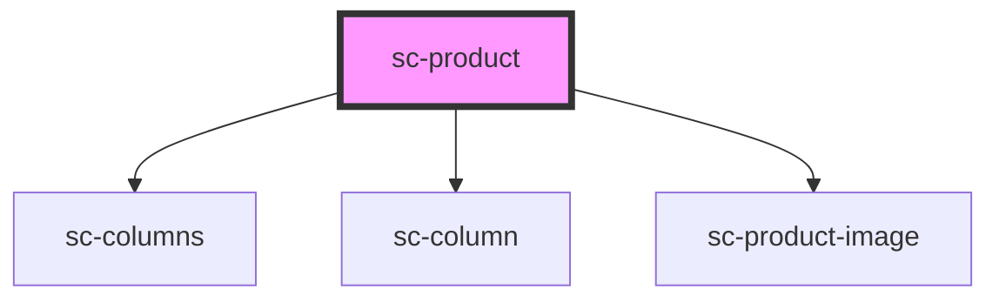

# sc-product

<!-- Auto Generated Below -->

## Properties

| Property        | Attribute        | Description                      | Type                | Default     |
| --------------- | ---------------- | -------------------------------- | ------------------- | ----------- |
| `columnGap`     | `column-gap`     |                                  | `string`            | `'2em'`     |
| `formId`        | `form-id`        | The form id to use for the cart. | `number`            | `undefined` |
| `mediaPosition` | `media-position` | The media position.              | `"left" \| "right"` | `'left'`    |
| `mediaWidth`    | `media-width`    | The media width.                 | `string`            | `'65%'`     |
| `mode`          | `mode`           | Are we in test or live mode.     | `"live" \| "test"`  | `'live'`    |
| `product`       | --               | The product.                     | `Product`           | `undefined` |

## Shadow Parts

| Part     | Description |
| -------- | ----------- |
| `"base"` |             |

## Dependencies

### Depends on

- [sc-columns](../../../ui/columns)
- [sc-column](../../../ui/column)
- [sc-product-image](../sc-product-image)

### Graph

----------------------------------------------

*Built with [StencilJS](https://stenciljs.com/)*
