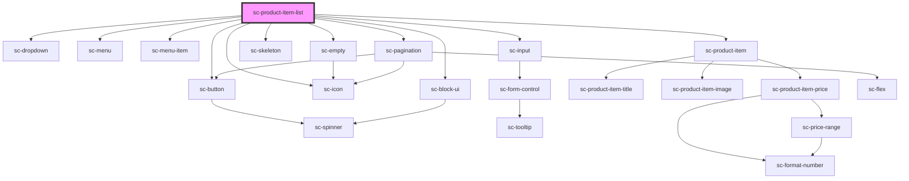

# sc-product-item-list

<!-- Auto Generated Below -->

## Properties

| Property              | Attribute              | Description            | Type                                        | Default             |
| --------------------- | ---------------------- | ---------------------- | ------------------------------------------- | ------------------- |
| `ajaxPagination`      | `ajax-pagination`      | Should we paginate?    | `boolean`                                   | `true`              |
| `ids`                 | --                     | Limit to a set of ids. | `string[]`                                  | `undefined`         |
| `layoutConfig`        | --                     |                        | `{ blockName: string; attributes: any; }[]` | `undefined`         |
| `limit`               | `limit`                |                        | `number`                                    | `15`                |
| `paginationAlignment` | `pagination-alignment` |                        | `string`                                    | `'center'`          |
| `paginationEnabled`   | `pagination-enabled`   | Should we paginate?    | `boolean`                                   | `true`              |
| `query`               | `query`                | Query to search for    | `string`                                    | `undefined`         |
| `searchEnabled`       | `search-enabled`       | Should allow search    | `boolean`                                   | `true`              |
| `sort`                | `sort`                 | Sort                   | `string`                                    | `'created_at:desc'` |
| `sortEnabled`         | `sort-enabled`         | Should allow search    | `boolean`                                   | `true`              |

## Dependencies

### Depends on

- [sc-dropdown](../../../ui/dropdown)
- [sc-button](../../../ui/button)
- [sc-menu](../../../ui/menu)
- [sc-menu-item](../../../ui/menu-item)
- [sc-input](../../../ui/input)
- [sc-icon](../../../ui/icon)
- [sc-empty](../../../ui/empty)
- [sc-skeleton](../../../ui/skeleton)
- [sc-product-item](../sc-product-item)
- [sc-pagination](../../../ui/pagination)
- [sc-block-ui](../../../ui/block-ui)

### Graph

----------------------------------------------

*Built with [StencilJS](https://stenciljs.com/)*
