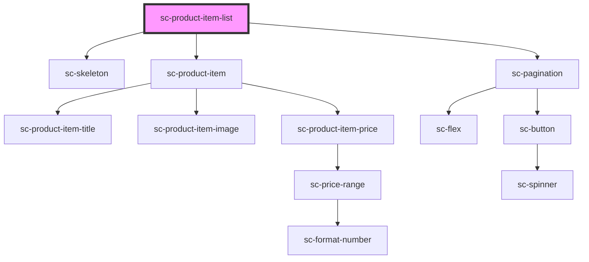

# sc-product-item-list

<!-- Auto Generated Below -->

## Properties

| Property              | Attribute              | Description | Type                                        | Default     |
| --------------------- | ---------------------- | ----------- | ------------------------------------------- | ----------- |
| `itemStyles`          | `item-styles`          |             | `any`                                       | `{}`        |
| `layoutConfig`        | --                     |             | `{ blockName: string; attributes: any; }[]` | `undefined` |
| `limit`               | `limit`                |             | `number`                                    | `15`        |
| `paginationAlignment` | `pagination-alignment` |             | `string`                                    | `'center'`  |

## Dependencies

### Depends on

- [sc-skeleton](../../../ui/skeleton)
- [sc-product-item](../sc-product-item)
- [sc-pagination](../../../ui/pagination)

### Graph

----------------------------------------------

*Built with [StencilJS](https://stenciljs.com/)*
