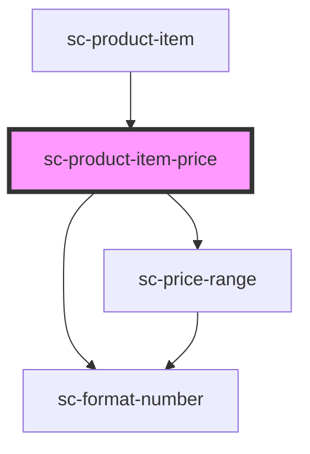

# sc-product-item-price

<!-- Auto Generated Below -->

## Properties

| Property | Attribute | Description       | Type      | Default     |
| -------- | --------- | ----------------- | --------- | ----------- |
| `prices` | --        |                   | `Price[]` | `undefined` |
| `range`  | `range`   | Show price range? | `boolean` | `true`      |

## Shadow Parts

| Part     | Description |
| -------- | ----------- |
| `"base"` |             |

## Dependencies

### Used by

 - [sc-product-item](../sc-product-item)

### Depends on

- [sc-format-number](../../../util/format-number)
- [sc-price-range](../../../ui/sc-price-range)

### Graph

----------------------------------------------

*Built with [StencilJS](https://stenciljs.com/)*
