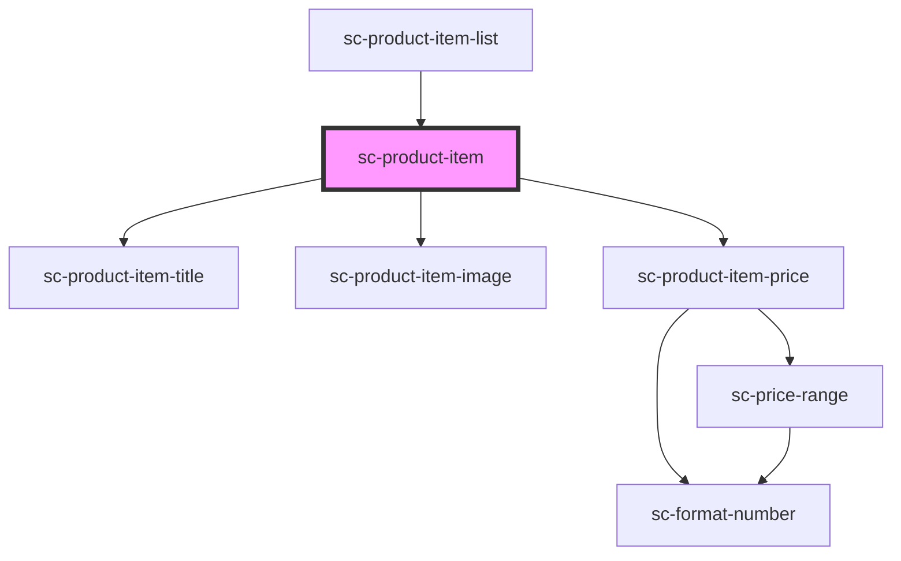

# sc-product-item

<!-- Auto Generated Below -->

## Properties

| Property       | Attribute | Description           | Type                                        | Default     |
| -------------- | --------- | --------------------- | ------------------------------------------- | ----------- |
| `layoutConfig` | --        | Product Layout Config | `{ blockName: string; attributes: any; }[]` | `undefined` |
| `product`      | --        | Product               | `Product`                                   | `undefined` |

## Events

| Event             | Description        | Type                                                                                                                                                                                                                                                                                                                                                                                                                                                                                                                                                                                                                                                                                                                                                                                                                                                           |
| ----------------- | ------------------ | -------------------------------------------------------------------------------------------------------------------------------------------------------------------------------------------------------------------------------------------------------------------------------------------------------------------------------------------------------------------------------------------------------------------------------------------------------------------------------------------------------------------------------------------------------------------------------------------------------------------------------------------------------------------------------------------------------------------------------------------------------------------------------------------------------------------------------------------------------------- |
| `scProductViewed` | Product was viewed | `CustomEvent<{ id?: string; name?: string; description?: string; archived?: boolean; archived_at?: string; metadata?: any; image_url?: string; recurring?: boolean; tax_category?: string; tax_enabled?: boolean; purchase_limit?: number; permalink?: string; weight?: number; weight_unit?: "kg" \| "lb" \| "g" \| "oz"; prices?: { object: "list"; pagination: Pagination; data: Price[]; }; product_medias?: { object: "list"; pagination: Pagination; data: ProductMedia[]; }; downloads?: { object: "list"; pagination: Pagination; data: Download[]; }; created_at?: number; updated_at?: number; constructor?: Function; toString?: () => string; toLocaleString?: () => string; valueOf?: () => Object; hasOwnProperty?: (v: PropertyKey) => boolean; isPrototypeOf?: (v: Object) => boolean; propertyIsEnumerable?: (v: PropertyKey) => boolean; }>` |

## Shadow Parts

| Part      | Description |
| --------- | ----------- |
| `"image"` |             |
| `"price"` |             |
| `"title"` |             |

## Dependencies

### Used by

 - [sc-product-item-list](../sc-product-item-list)

### Depends on

- [sc-product-item-title](../sc-product-item-title)
- [sc-product-item-image](../sc-product-item-image)
- [sc-product-item-price](../sc-product-item-price)

### Graph

----------------------------------------------

*Built with [StencilJS](https://stenciljs.com/)*
