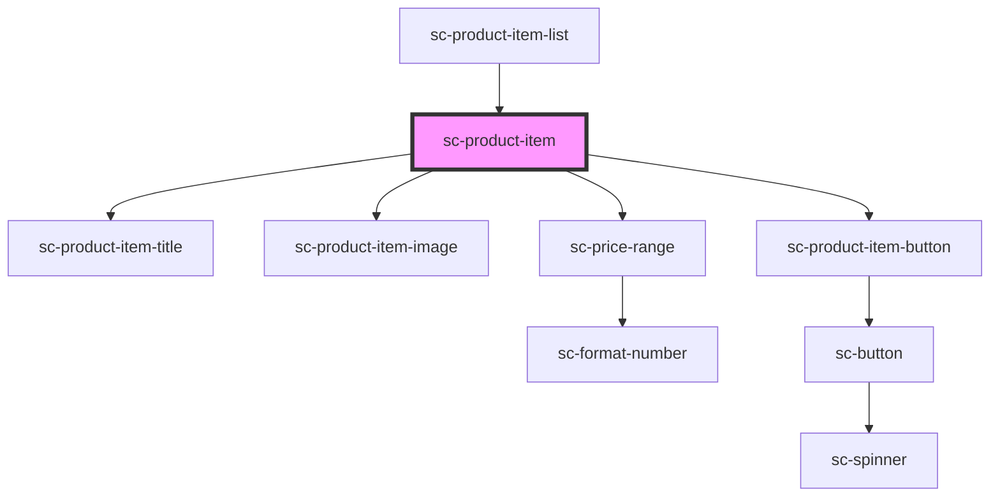

# sc-product-item

<!-- Auto Generated Below -->

## Properties

| Property       | Attribute | Description | Type                                        | Default     |
| -------------- | --------- | ----------- | ------------------------------------------- | ----------- |
| `layoutConfig` | --        |             | `{ blockName: string; attributes: any; }[]` | `undefined` |
| `product`      | --        |             | `Product`                                   | `undefined` |

## Dependencies

### Used by

 - [sc-product-item-list](../sc-product-item-list)

### Depends on

- [sc-product-item-title](../sc-product-item-title)
- [sc-product-item-image](../sc-product-item-image)
- [sc-price-range](../../../ui/sc-price-range)
- [sc-product-item-button](../sc-product-item-button)

### Graph

----------------------------------------------

*Built with [StencilJS](https://stenciljs.com/)*
