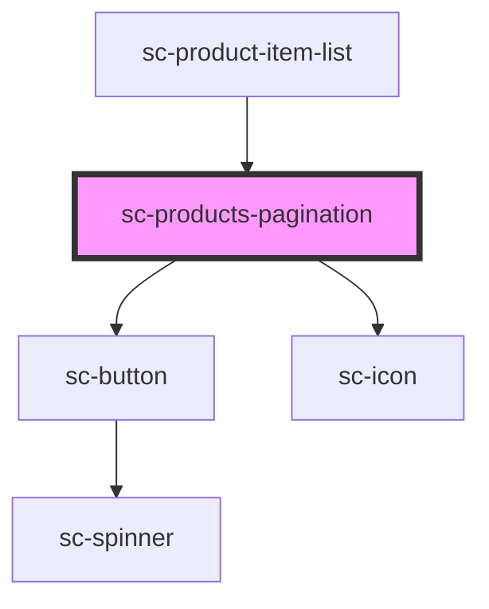

# sc-products-pagination

<!-- Auto Generated Below -->

## Properties

| Property      | Attribute      | Description | Type     | Default     |
| ------------- | -------------- | ----------- | -------- | ----------- |
| `currentPage` | `current-page` |             | `number` | `undefined` |
| `totalPages`  | `total-pages`  |             | `number` | `undefined` |

## Events

| Event         | Description | Type                  |
| ------------- | ----------- | --------------------- |
| `scPageClick` |             | `CustomEvent<number>` |

## Dependencies

### Used by

 - [sc-product-item-list](../sc-product-item-list)

### Depends on

- [sc-button](../../../ui/button)
- [sc-icon](../../../ui/icon)

### Graph

----------------------------------------------

*Built with [StencilJS](https://stenciljs.com/)*
