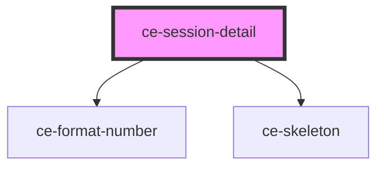

# ce-card

<!-- Auto Generated Below -->

## Properties

| Property          | Attribute  | Description | Type              | Default     |
| ----------------- | ---------- | ----------- | ----------------- | ----------- |
| `order` | --         |             | `Order` | `undefined` |
| `fallback`        | `fallback` |             | `string`          | `undefined` |
| `label`           | `label`    |             | `string`          | `undefined` |
| `loading`         | `loading`  |             | `boolean`         | `undefined` |
| `metaKey`         | `meta-key` |             | `string`          | `undefined` |
| `value`           | `value`    |             | `string`          | `undefined` |

## Shadow Parts

| Part      | Description |
| --------- | ----------- |
| `"base"`  |             |
| `"label"` |             |
| `"value"` |             |

## Dependencies

### Depends on

- [ce-format-number](../../util/format-number)
- [ce-skeleton](../../ui/skeleton)

### Graph

----------------------------------------------

*Built with [StencilJS](https://stenciljs.com/)*
