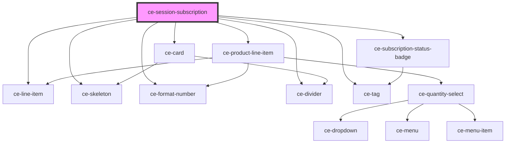

# ce-session-subscription

<!-- Auto Generated Below -->

## Properties

| Property  | Attribute  | Description | Type     | Default     |
| --------- | ---------- | ----------- | -------- | ----------- |
| `orderId` | `order-id` |             | `string` | `undefined` |

## Shadow Parts

| Part           | Description |
| -------------- | ----------- |
| `"line-items"` |             |

## Dependencies

### Depends on

- [ce-line-item](../../ui/line-item)
- [ce-skeleton](../../ui/skeleton)
- [ce-product-line-item](../../ui/product-line-item)
- [ce-subscription-status-badge](../../ui/subscription-status-badge)
- [ce-format-number](../../util/format-number)
- [ce-divider](../../ui/divider)
- [ce-card](../../ui/card)
- [ce-tag](../../ui/tag)

### Graph

----------------------------------------------

*Built with [StencilJS](https://stenciljs.com/)*
