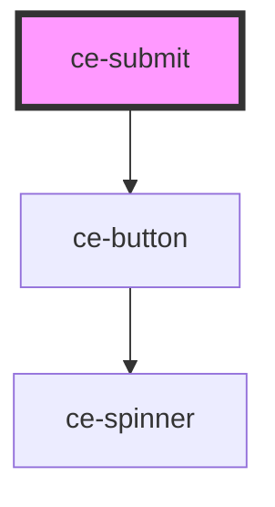

# ce-submit

<!-- Auto Generated Below -->

## Properties

| Property      | Attribute     | Description                 | Type                             | Default                             |
| ------------- | ------------- | --------------------------- | -------------------------------- | ----------------------------------- |
| `calculating` | `calculating` | Are the totals calculating  | `boolean`                        | `undefined`                         |
| `full`        | `full`        | Draws the button full-width | `boolean`                        | `true`                              |
| `loading`     | --            | Is the form loading         | `Loading`                        | `{ prices: false, session: false }` |
| `size`        | `size`        | The button's size.          | `"large" \| "medium" \| "small"` | `'large'`                           |
| `text`        | `text`        | Draws the button full-width | `string`                         | `''`                                |

## Dependencies

### Depends on

- [ce-button](../../ui/button)

### Graph

----------------------------------------------

*Built with [StencilJS](https://stenciljs.com/)*
