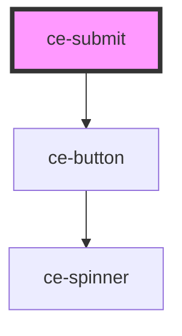

# ce-submit

<!-- Auto Generated Below -->

## Properties

| Property          | Attribute    | Description                 | Type                                                                                 | Default     |
| ----------------- | ------------ | --------------------------- | ------------------------------------------------------------------------------------ | ----------- |
| `checkoutSession` | --           | Checkout session object     | `CheckoutSession`                                                                    | `undefined` |
| `full`            | `full`       | Draws the button full-width | `boolean`                                                                            | `true`      |
| `showTotal`       | `show-total` | Total                       | `boolean`                                                                            | `false`     |
| `size`            | `size`       | The button's size.          | `"large" \| "medium" \| "small"`                                                     | `'large'`   |
| `state`           | `state`      | Is the form loading         | `"draft" \| "failure" \| "finalized" \| "idle" \| "loading" \| "paid" \| "updating"` | `undefined` |
| `text`            | `text`       | Draws the button full-width | `string`                                                                             | `''`        |

## Dependencies

### Depends on

- [ce-button](../../ui/button)

### Graph

----------------------------------------------

*Built with [StencilJS](https://stenciljs.com/)*
