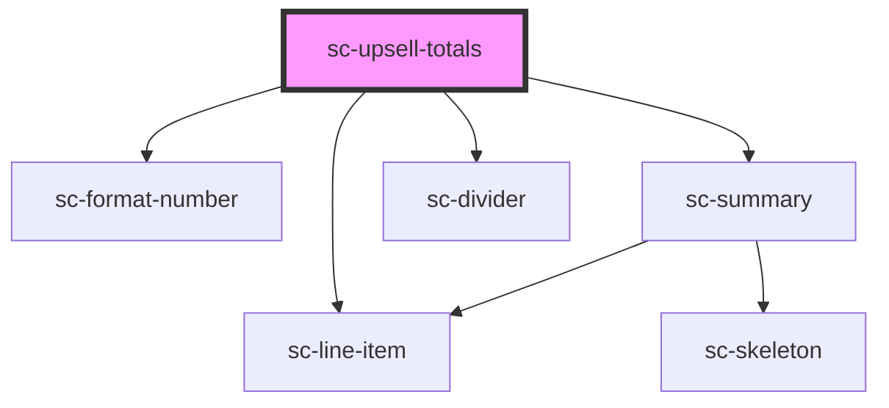

# sc-upsell

<!-- Auto Generated Below -->

## Dependencies

### Depends on

- [sc-format-number](../../../util/format-number)
- [sc-summary](../../../ui/sc-summary)
- [sc-divider](../../../ui/divider)
- [sc-line-item](../../../ui/line-item)

### Graph

----------------------------------------------

*Built with [StencilJS](https://stenciljs.com/)*
