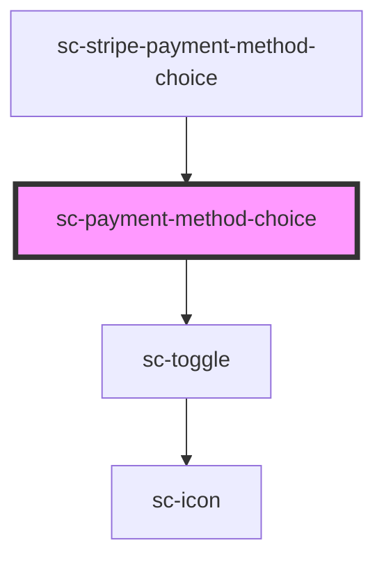

# sc-payment-method-choice

<!-- Auto Generated Below -->

## Properties

| Property    | Attribute    | Description            | Type      | Default     |
| ----------- | ------------ | ---------------------- | --------- | ----------- |
| `hasOthers` | `has-others` | Does this have others? | `boolean` | `undefined` |
| `open`      | `open`       | Is this open?          | `boolean` | `undefined` |

## Events

| Event    | Description     | Type                |
| -------- | --------------- | ------------------- |
| `scShow` | Show the toggle | `CustomEvent<void>` |

## Dependencies

### Used by

 - [sc-stripe-payment-method-choice](../sc-stripe-payment-method-choice)

### Depends on

- [sc-toggle](../../ui/sc-toggle)

### Graph

----------------------------------------------

*Built with [StencilJS](https://stenciljs.com/)*
