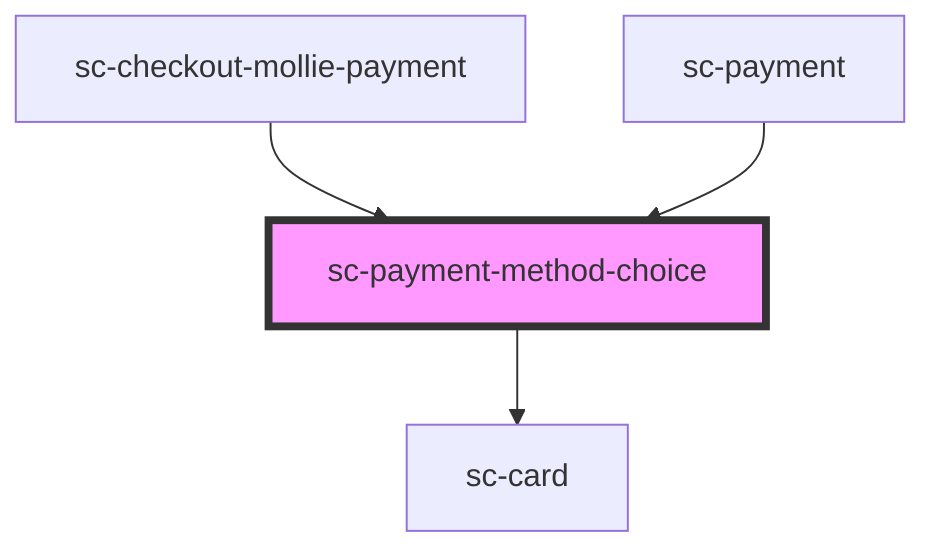

# sc-payment-method-choice

<!-- Auto Generated Below -->

## Properties

| Property      | Attribute      | Description                    | Type      | Default     |
| ------------- | -------------- | ------------------------------ | --------- | ----------- |
| `card`        | `card`         | Should we show this in a card? | `boolean` | `undefined` |
| `isManual`    | `is-manual`    | Is this a manual processor     | `boolean` | `undefined` |
| `methodId`    | `method-id`    | The method id                  | `string`  | `undefined` |
| `processorId` | `processor-id` | The processor ID               | `string`  | `undefined` |

## Dependencies

### Used by

 - [sc-checkout-mollie-payment](../../controllers/checkout-form/sc-checkout-mollie-payment)
 - [sc-payment](../../controllers/checkout-form/payment)

### Depends on

- [sc-card](../../ui/card)

### Graph

----------------------------------------------

*Built with [StencilJS](https://stenciljs.com/)*
