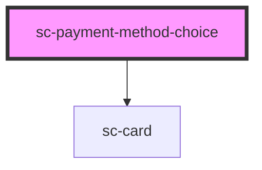

# sc-payment-method-choice

<!-- Auto Generated Below -->

## Properties

| Property           | Attribute           | Description                    | Type       | Default     |
| ------------------ | ------------------- | ------------------------------ | ---------- | ----------- |
| `card`             | `card`              | Should we show this in a card? | `boolean`  | `undefined` |
| `checkout`         | --                  | The checkout.                  | `Checkout` | `undefined` |
| `hasOthers`        | `has-others`        | Does this have others?         | `boolean`  | `undefined` |
| `isDisabled`       | `is-disabled`       | Is this disabled?              | `boolean`  | `undefined` |
| `isManual`         | `is-manual`         | Is this a manual processor     | `boolean`  | `undefined` |
| `processor`        | `processor`         | The current processor          | `string`   | `undefined` |
| `processorId`      | `processor-id`      | The processor ID               | `string`   | `undefined` |
| `recurringEnabled` | `recurring-enabled` | Is this recurring-enabled?     | `boolean`  | `undefined` |

## Events

| Event                | Description                        | Type                                            |
| -------------------- | ---------------------------------- | ----------------------------------------------- |
| `scProcessorInvalid` | The currenct processor is invalid. | `CustomEvent<void>`                             |
| `scSetProcessor`     | Set the order procesor.            | `CustomEvent<{ id: string; manual: boolean; }>` |
| `scShow`             | Show the toggle                    | `CustomEvent<void>`                             |

## Dependencies

### Depends on

- [sc-card](../../ui/card)

### Graph

----------------------------------------------

*Built with [StencilJS](https://stenciljs.com/)*
