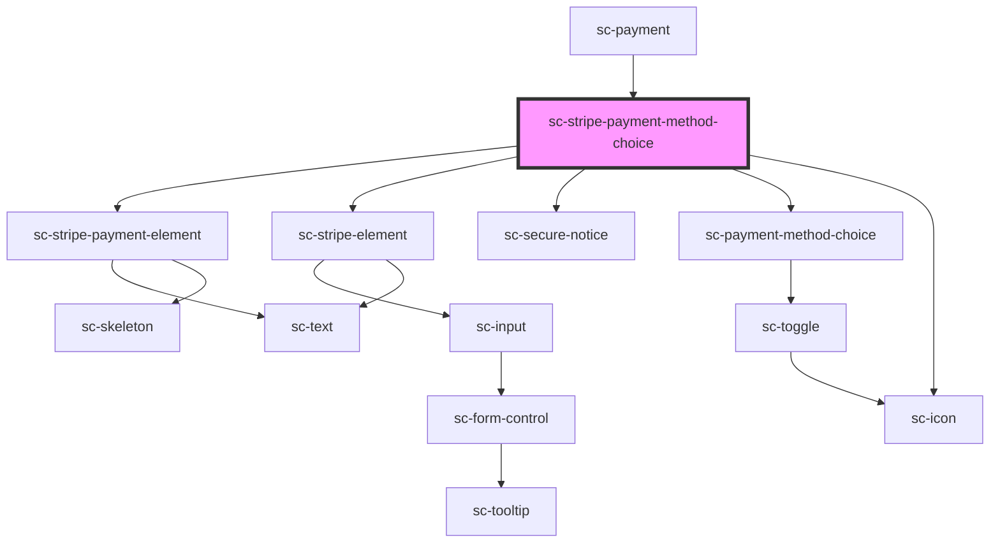

# sc-stripe-payment-method-choice

<!-- Auto Generated Below -->

## Properties

| Property               | Attribute                | Description                      | Type               | Default     |
| ---------------------- | ------------------------ | -------------------------------- | ------------------ | ----------- |
| `checkout`             | --                       | The checkout.                    | `Checkout`         | `undefined` |
| `mode`                 | `mode`                   | Is this created in "test" mode   | `"live" \| "test"` | `'live'`    |
| `processor`            | `processor`              | The currently selected processor | `string`           | `undefined` |
| `processors`           | --                       | List of available processors.    | `Processor[]`      | `[]`        |
| `secureNotice`         | `secure-notice`          | The secure notice.               | `string`           | `undefined` |
| `stripePaymentElement` | `stripe-payment-element` | Use the Stripe payment element.  | `boolean`          | `undefined` |
| `stripePaymentIntent`  | --                       | The stripe payment intent.       | `PaymentIntent`    | `undefined` |

## Events

| Event            | Description             | Type                  |
| ---------------- | ----------------------- | --------------------- |
| `scSetProcessor` | Set the order procesor. | `CustomEvent<string>` |

## Dependencies

### Used by

 - [sc-payment](../../controllers/checkout-form/payment)

### Depends on

- [sc-stripe-payment-element](../../ui/stripe-payment-element)
- [sc-stripe-element](../../ui/stripe-element)
- [sc-secure-notice](../../ui/secure-notice)
- [sc-payment-method-choice](../sc-payment-method-choice)
- [sc-icon](../../ui/icon)

### Graph

----------------------------------------------

*Built with [StencilJS](https://stenciljs.com/)*
