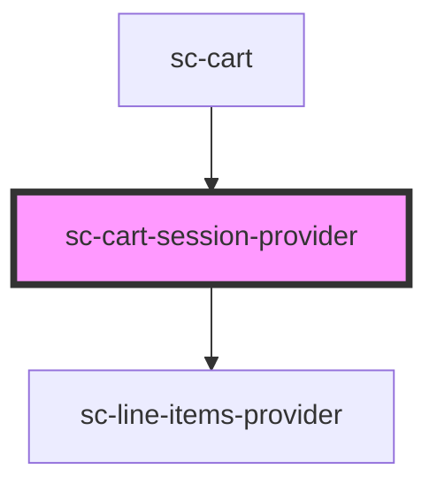

# sc-cart-session-provider

<!-- Auto Generated Below -->

## Properties

| Property | Attribute | Description  | Type    | Default     |
| -------- | --------- | ------------ | ------- | ----------- |
| `order`  | --        | Order Object | `Order` | `undefined` |

## Events

| Event                | Description             | Type                                                                                          |
| -------------------- | ----------------------- | --------------------------------------------------------------------------------------------- |
| `scError`            | Error event             | `CustomEvent<{ message: string; code?: string; data?: any; additional_errors?: any; } \| {}>` |
| `scSetState`         | Set the state           | `CustomEvent<"busy" \| "idle" \| "loading" \| "navigating">`                                  |
| `scUpdateOrderState` | Update line items event | `CustomEvent<Order>`                                                                          |

## Dependencies

### Used by

 - [sc-cart](../../controllers/cart/sc-cart)

### Depends on

- [sc-line-items-provider](../line-items-provider)

### Graph

----------------------------------------------

*Built with [StencilJS](https://stenciljs.com/)*
