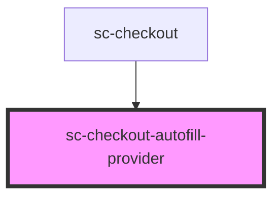

# sc-checkout-autofill-provider

<!-- Auto Generated Below -->

## Overview

Headless provider: when a logged-in user is on a draft checkout, fetches the
customer's saved profile (shipping/billing address, name, phone) and patches the
draft checkout with any fields that aren't already set. Runs at most once per
checkout id. Address and name components read the patched values from
`checkoutState.checkout` via their own subscriptions — this provider doesn't
touch component state directly.

## Dependencies

### Used by

 - [sc-checkout](../../controllers/checkout-form/checkout)

### Graph

----------------------------------------------

*Built with [StencilJS](https://stenciljs.com/)*
