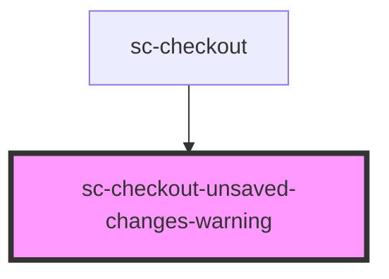

# sc-checkout-unsaved-changes-warning

<!-- Auto Generated Below -->

## Properties

| Property | Attribute | Description | Type                                                                                                                                          | Default     |
| -------- | --------- | ----------- | --------------------------------------------------------------------------------------------------------------------------------------------- | ----------- |
| `state`  | `state`   |             | `"confirmed" \| "confirming" \| "draft" \| "expired" \| "failure" \| "finalizing" \| "idle" \| "loading" \| "paid" \| "paying" \| "updating"` | `undefined` |

## Dependencies

### Used by

 - [sc-checkout](../../controllers/checkout-form/checkout)

### Graph

----------------------------------------------

*Built with [StencilJS](https://stenciljs.com/)*
