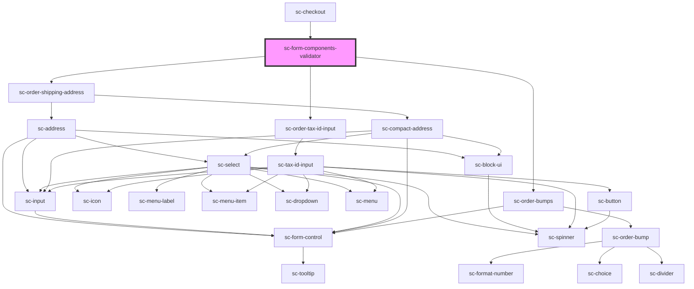

# ce-form-components-validator

<!-- Auto Generated Below -->

## Properties

| Property      | Attribute  | Description         | Type          | Default     |
| ------------- | ---------- | ------------------- | ------------- | ----------- |
| `disabled`    | `disabled` | Disable validation? | `boolean`     | `undefined` |
| `order`       | --         | The order           | `Checkout`    | `undefined` |
| `taxProtocol` | --         | The tax protocol    | `TaxProtocol` | `undefined` |

## Dependencies

### Used by

 - [sc-checkout](../../controllers/checkout-form/checkout)

### Depends on

- [sc-order-shipping-address](../../controllers/checkout-form/order-shipping-address)
- [sc-order-tax-id-input](../../controllers/checkout-form/order-tax-id-input)
- [sc-order-bumps](../../controllers/checkout-form/sc-order-bumps)

### Graph

----------------------------------------------

*Built with [StencilJS](https://stenciljs.com/)*
