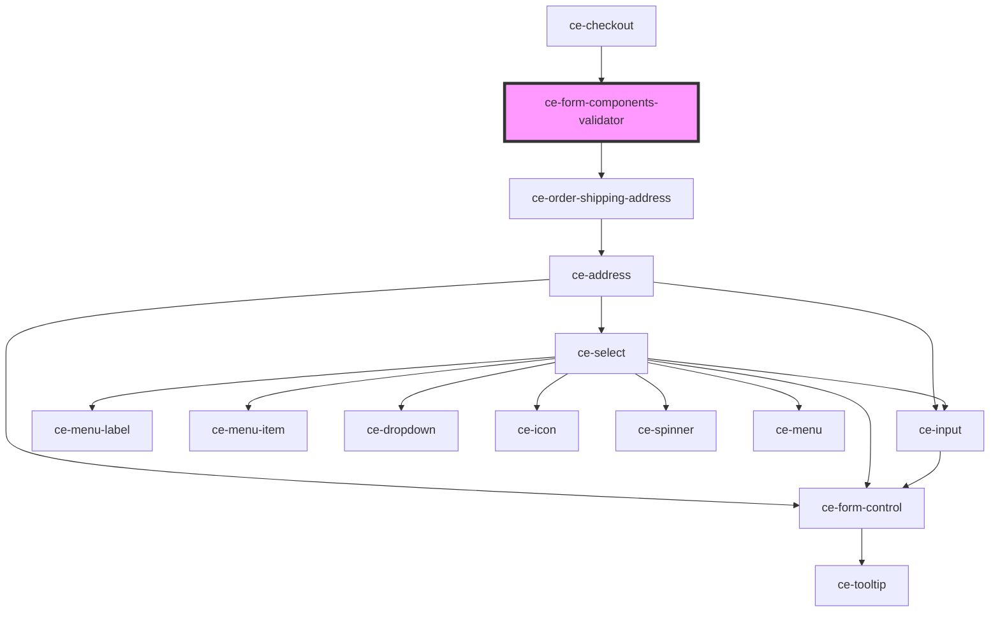

# ce-form-components-validator

<!-- Auto Generated Below -->

## Properties

| Property   | Attribute  | Description | Type      | Default     |
| ---------- | ---------- | ----------- | --------- | ----------- |
| `disabled` | `disabled` |             | `boolean` | `undefined` |
| `order`    | --         | The order   | `Order`   | `undefined` |

## Dependencies

### Used by

 - [ce-checkout](../../controllers/checkout-form/checkout)

### Depends on

- [ce-order-shipping-address](../../controllers/checkout-form/order-shipping-address)

### Graph

----------------------------------------------

*Built with [StencilJS](https://stenciljs.com/)*
