# ce-form-components-validator

<!-- Auto Generated Below -->

## Properties

| Property      | Attribute  | Description         | Type          | Default     |
| ------------- | ---------- | ------------------- | ------------- | ----------- |
| `disabled`    | `disabled` | Disable validation? | `boolean`     | `undefined` |
| `taxProtocol` | --         | The tax protocol    | `TaxProtocol` | `undefined` |

## Dependencies

### Used by

 - [sc-checkout](../../controllers/checkout-form/checkout)

### Depends on

- [sc-order-shipping-address](../../controllers/checkout-form/order-shipping-address)
- [sc-order-billing-address](../../controllers/checkout-form/sc-order-billing-address)
- [sc-order-tax-id-input](../../controllers/checkout-form/order-tax-id-input)
- [sc-order-bumps](../../controllers/checkout-form/sc-order-bumps)
- [sc-line-item-tax](../../controllers/checkout-form/line-item-tax)
- [sc-shipping-choices](../../ui/sc-shipping-choices)
- [sc-line-item-shipping](../../controllers/checkout-form/sc-line-item-shipping)
- [sc-invoice-details](../../controllers/checkout-form/invoice-details)
- [sc-line-item-invoice-number](../../controllers/checkout-form/invoice-number)
- [sc-line-item-invoice-due-date](../../controllers/checkout-form/invoice-due-date)
- [sc-line-item-invoice-receipt-download](../../controllers/checkout-form/invoice-receipt-download)
- [sc-divider](../../ui/divider)
- [sc-invoice-memo](../../controllers/checkout-form/invoice-memo)
- [sc-line-item-trial](../../controllers/checkout-form/line-item-trial)

### Graph

```mermaid
graph TD;
  sc-form-components-validator --> sc-order-shipping-address
  sc-form-components-validator --> sc-order-billing-address
  sc-form-components-validator --> sc-order-tax-id-input
  sc-form-components-validator --> sc-order-bumps
  sc-form-components-validator --> sc-line-item-tax
  sc-form-components-validator --> sc-shipping-choices
  sc-form-components-validator --> sc-line-item-shipping
  sc-form-components-validator --> sc-invoice-details
  sc-form-components-validator --> sc-line-item-invoice-number
  sc-form-components-validator --> sc-line-item-invoice-due-date
  sc-form-components-validator --> sc-line-item-invoice-receipt-download
  sc-form-components-validator --> sc-divider
  sc-form-components-validator --> sc-invoice-memo
  sc-form-components-validator --> sc-line-item-trial
  sc-order-shipping-address --> sc-address
  sc-order-shipping-address --> sc-compact-address
  sc-address --> sc-form-control
  sc-address --> sc-select
  sc-address --> sc-input
  sc-address --> sc-block-ui
  sc-form-control --> sc-visually-hidden
  sc-select --> sc-icon
  sc-select --> sc-menu-label
  sc-select --> sc-menu-item
  sc-select --> sc-form-control
  sc-select --> sc-dropdown
  sc-select --> sc-input
  sc-select --> sc-spinner
  sc-select --> sc-menu
  sc-input --> sc-form-control
  sc-block-ui --> sc-spinner
  sc-compact-address --> sc-form-control
  sc-compact-address --> sc-select
  sc-compact-address --> sc-input
  sc-compact-address --> sc-block-ui
  sc-order-billing-address --> sc-checkbox
  sc-order-billing-address --> sc-address
  sc-order-tax-id-input --> sc-tax-id-input
  sc-tax-id-input --> sc-icon
  sc-tax-id-input --> sc-input
  sc-tax-id-input --> sc-spinner
  sc-tax-id-input --> sc-dropdown
  sc-tax-id-input --> sc-button
  sc-tax-id-input --> sc-menu
  sc-tax-id-input --> sc-menu-item
  sc-button --> sc-spinner
  sc-order-bumps --> sc-form-control
  sc-order-bumps --> sc-order-bump
  sc-order-bump --> sc-choice
  sc-order-bump --> sc-divider
  sc-line-item-tax --> sc-line-item
  sc-shipping-choices --> sc-form-control
  sc-shipping-choices --> sc-radio-group
  sc-shipping-choices --> sc-radio
  sc-shipping-choices --> sc-format-number
  sc-shipping-choices --> sc-block-ui
  sc-line-item-shipping --> sc-line-item
  sc-line-item-shipping --> sc-skeleton
  sc-line-item-invoice-number --> sc-line-item
  sc-line-item-invoice-number --> sc-skeleton
  sc-line-item-invoice-due-date --> sc-line-item
  sc-line-item-invoice-due-date --> sc-skeleton
  sc-line-item-invoice-receipt-download --> sc-line-item
  sc-line-item-invoice-receipt-download --> sc-skeleton
  sc-line-item-invoice-receipt-download --> sc-icon
  sc-invoice-memo --> sc-skeleton
  sc-line-item-trial --> sc-line-item
  sc-checkout --> sc-form-components-validator
  style sc-form-components-validator fill:#f9f,stroke:#333,stroke-width:4px
```

----------------------------------------------

*Built with [StencilJS](https://stenciljs.com/)*
