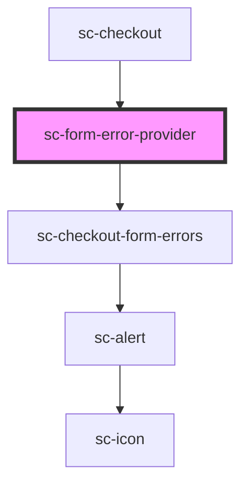

# sc-form-error-provider

<!-- Auto Generated Below -->

## Overview

This component checks to make sure there is an error component
and adds one if it's missing.

## Dependencies

### Used by

 - [sc-checkout](../../controllers/checkout-form/checkout)

### Depends on

- [sc-checkout-form-errors](../../controllers/checkout-form/checkout-form-errors)

### Graph

----------------------------------------------

*Built with [StencilJS](https://stenciljs.com/)*
