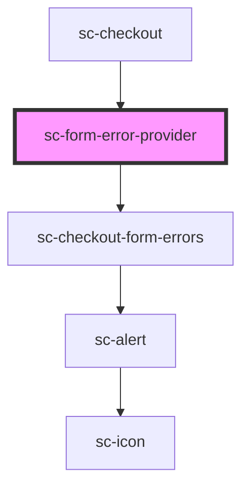

# sc-form-error-provider

<!-- Auto Generated Below -->

## Properties

| Property        | Attribute        | Description        | Type                                                                                                                                                           | Default     |
| --------------- | ---------------- | ------------------ | -------------------------------------------------------------------------------------------------------------------------------------------------------------- | ----------- |
| `checkoutState` | `checkout-state` | The current order. | `"confirmed" \| "confirming" \| "draft" \| "expired" \| "failure" \| "finalizing" \| "idle" \| "loading" \| "paid" \| "paying" \| "redirecting" \| "updating"` | `undefined` |

## Events

| Event           | Description       | Type                                                                                            |
| --------------- | ----------------- | ----------------------------------------------------------------------------------------------- |
| `scSetState`    | Form state event. | `CustomEvent<"EXPIRE" \| "FETCH" \| "FINALIZE" \| "PAID" \| "PAYING" \| "REJECT" \| "RESOLVE">` |
| `scUpdateError` | Set the state.    | `CustomEvent<ResponseError>`                                                                    |

## Dependencies

### Used by

 - [sc-checkout](../../controllers/checkout-form/checkout)

### Depends on

- [sc-checkout-form-errors](../../controllers/checkout-form/checkout-form-errors)

### Graph

----------------------------------------------

*Built with [StencilJS](https://stenciljs.com/)*
