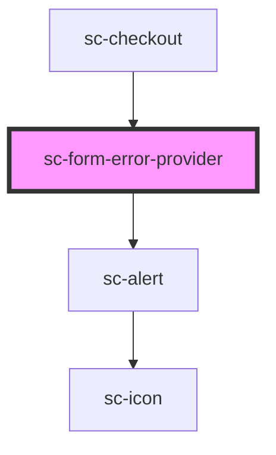

# sc-form-error-provider

<!-- Auto Generated Below -->

## Properties

| Property | Attribute | Description        | Type    | Default     |
| -------- | --------- | ------------------ | ------- | ----------- |
| `order`  | --        | The current order. | `Order` | `undefined` |

## Events

| Event           | Description       | Type                                                                                |
| --------------- | ----------------- | ----------------------------------------------------------------------------------- |
| `scSetState`    | Form state event. | `CustomEvent<"EXPIRE" \| "FETCH" \| "FINALIZE" \| "PAID" \| "REJECT" \| "RESOLVE">` |
| `scUpdateError` | Set the state.    | `CustomEvent<ResponseError>`                                                        |

## Dependencies

### Used by

 - [sc-checkout](../../controllers/checkout-form/checkout)

### Depends on

- [sc-alert](../../ui/alert)

### Graph

----------------------------------------------

*Built with [StencilJS](https://stenciljs.com/)*
