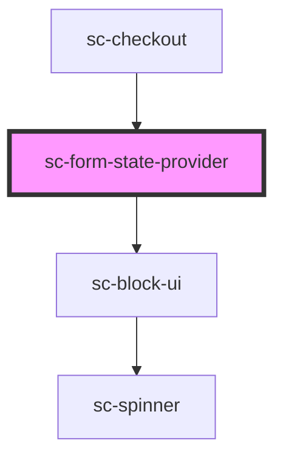

# sc-form-state-provider

<!-- Auto Generated Below -->

## Events

| Event                    | Description    | Type                                                                                                                                                                        |
| ------------------------ | -------------- | --------------------------------------------------------------------------------------------------------------------------------------------------------------------------- |
| `scSetCheckoutFormState` | Set the state. | `CustomEvent<"confirmed" \| "confirming" \| "draft" \| "expired" \| "failure" \| "finalizing" \| "idle" \| "loading" \| "paid" \| "paying" \| "redirecting" \| "updating">` |

## Dependencies

### Used by

 - [sc-checkout](../../controllers/checkout-form/checkout)

### Depends on

- [sc-block-ui](../../ui/block-ui)

### Graph

----------------------------------------------

*Built with [StencilJS](https://stenciljs.com/)*
