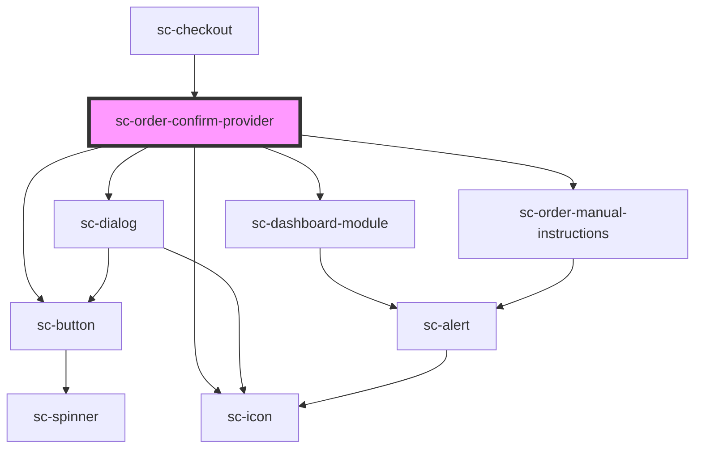

# sc-order-confirm-provider

<!-- Auto Generated Below -->

## Properties

| Property      | Attribute     | Description                  | Type                                                      | Default     |
| ------------- | ------------- | ---------------------------- | --------------------------------------------------------- | ----------- |
| `formId`      | `form-id`     | The form id                  | `number`                                                  | `undefined` |
| `mode`        | `mode`        | Are we in test or live mode. | `"live" \| "test"`                                        | `'live'`    |
| `order`       | --            | The current order.           | `Checkout`                                                | `undefined` |
| `successText` | --            | Success text for the form.   | `{ title: string; description: string; button: string; }` | `undefined` |
| `successUrl`  | `success-url` | Success url.                 | `string`                                                  | `undefined` |

## Events

| Event         | Description              | Type                                                                                          |
| ------------- | ------------------------ | --------------------------------------------------------------------------------------------- |
| `scError`     | Error event.             | `CustomEvent<{ message: string; code?: string; data?: any; additional_errors?: any; } \| {}>` |
| `scOrderPaid` | The order is paid event. | `CustomEvent<Checkout>`                                                                       |
| `scSetState`  |                          | `CustomEvent<string>`                                                                         |

## Dependencies

### Used by

 - [sc-checkout](../../controllers/checkout-form/checkout)

### Depends on

- [sc-dialog](../../ui/sc-dialog)
- [sc-icon](../../ui/icon)
- [sc-dashboard-module](../../ui/dashboard-module)
- [sc-order-manual-instructions](../../controllers/confirmation/manual-instructions)
- [sc-button](../../ui/button)

### Graph

----------------------------------------------

*Built with [StencilJS](https://stenciljs.com/)*
