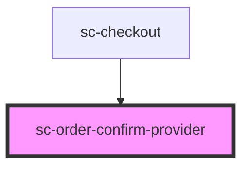

# sc-order-confirm-provider

<!-- Auto Generated Below -->

## Properties

| Property     | Attribute     | Description                  | Type               | Default     |
| ------------ | ------------- | ---------------------------- | ------------------ | ----------- |
| `formId`     | `form-id`     | The form id                  | `number`           | `undefined` |
| `mode`       | `mode`        | Are we in test or live mode. | `"live" \| "test"` | `'live'`    |
| `order`      | --            | The current order.           | `Order`            | `undefined` |
| `successUrl` | `success-url` | Success url.                 | `string`           | `undefined` |

## Events

| Event         | Description                   | Type                                                                                          |
| ------------- | ----------------------------- | --------------------------------------------------------------------------------------------- |
| `scConfirmed` | The order is confirmed event. | `CustomEvent<void>`                                                                           |
| `scError`     | Error event.                  | `CustomEvent<{ message: string; code?: string; data?: any; additional_errors?: any; } \| {}>` |
| `scOrderPaid` | The order is paid event.      | `CustomEvent<Order>`                                                                          |

## Dependencies

### Used by

 - [sc-checkout](../../controllers/checkout-form/checkout)

### Graph

----------------------------------------------

*Built with [StencilJS](https://stenciljs.com/)*
