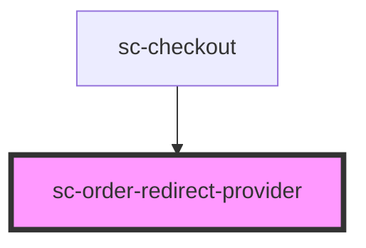

# sc-order-redirect-provider

<!-- Auto Generated Below -->

## Properties

| Property     | Attribute     | Description        | Type     | Default     |
| ------------ | ------------- | ------------------ | -------- | ----------- |
| `order`      | --            | The current order. | `Order`  | `undefined` |
| `successUrl` | `success-url` | The success url.   | `string` | `undefined` |

## Events

| Event        | Description       | Type                                                                                          |
| ------------ | ----------------- | --------------------------------------------------------------------------------------------- |
| `scError`    | Error event.      | `CustomEvent<{ message: string; code?: string; data?: any; additional_errors?: any; } \| {}>` |
| `scSetState` | Form state event. | `CustomEvent<"EXPIRE" \| "FETCH" \| "FINALIZE" \| "PAID" \| "REJECT" \| "RESOLVE">`           |

## Dependencies

### Used by

 - [sc-checkout](../../controllers/checkout-form/checkout)

### Graph

----------------------------------------------

*Built with [StencilJS](https://stenciljs.com/)*
