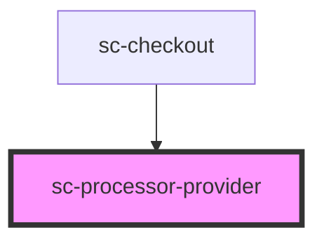

# sc-processor-provider

<!-- Auto Generated Below -->

## Properties

| Property     | Attribute   | Description                      | Type          | Default     |
| ------------ | ----------- | -------------------------------- | ------------- | ----------- |
| `checkout`   | --          | The current checkout             | `Checkout`    | `undefined` |
| `processor`  | `processor` | The currently selected processor | `string`      | `undefined` |
| `processors` | --          | A list of available processors   | `Processor[]` | `[]`        |

## Events

| Event            | Description                               | Type                  |
| ---------------- | ----------------------------------------- | --------------------- |
| `scSetProcessor` | Event to set a processor in the checkout. | `CustomEvent<string>` |

## Dependencies

### Used by

 - [sc-checkout](../../controllers/checkout-form/checkout)

### Graph

----------------------------------------------

*Built with [StencilJS](https://stenciljs.com/)*
