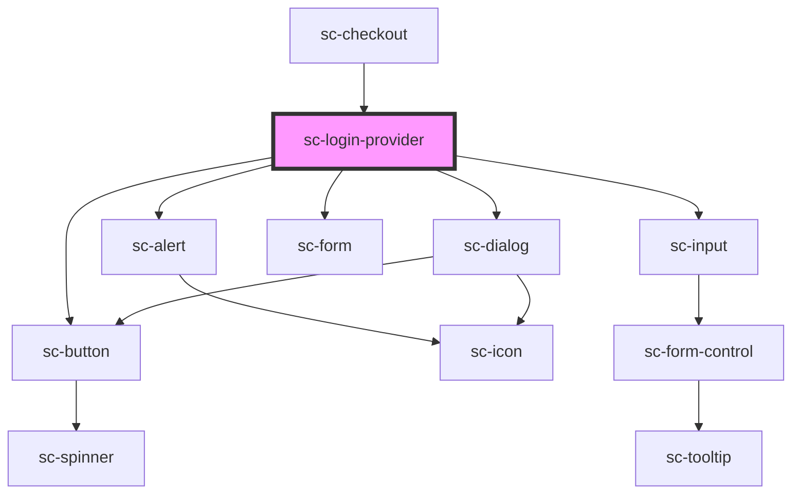

# sc-login-provider

<!-- Auto Generated Below -->

## Properties

| Property   | Attribute   | Description            | Type      | Default     |
| ---------- | ----------- | ---------------------- | --------- | ----------- |
| `loggedIn` | `logged-in` | Is the user logged in. | `boolean` | `undefined` |
| `order`    | --          |                        | `Order`   | `undefined` |

## Events

| Event           | Description | Type                                             |
| --------------- | ----------- | ------------------------------------------------ |
| `scSetCustomer` |             | `CustomEvent<{ email: string; name?: string; }>` |
| `scSetLoggedIn` |             | `CustomEvent<boolean>`                           |

## Dependencies

### Used by

 - [sc-checkout](../../controllers/checkout-form/checkout)

### Depends on

- [sc-alert](../../ui/alert)
- [sc-dialog](../../ui/sc-dialog)
- [sc-form](../../ui/form)
- [sc-input](../../ui/input)
- [sc-button](../../ui/button)

### Graph

----------------------------------------------

*Built with [StencilJS](https://stenciljs.com/)*
